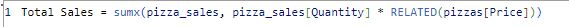
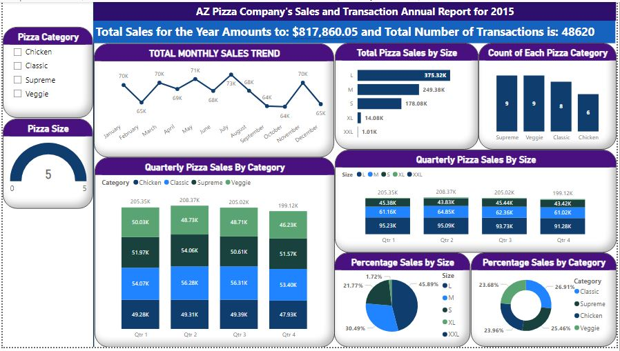

# PIZZA-SALES-REPORT

---
## **Project Outline**
- [Project Overview](#Project-Overview)
- [Dataset](#Dataset)
- [Tools Used for Analysis](#Tools-Used-for-Analysis)
- [Data Cleaning and Transformation](#Data-Cleaning-and-Transformation)
- [Results and Findings](#Results-and-Findings)
- [Recommendation](#Recommendation)
---

## Project Overview
The purpose of this project is to perform data analysis on the PIZZA SALES dataset in order to know where AZ pizza company should focus on to increase sales and returns by 100%.

---
## Dataset
The dataset used can be downloaded 
[here](https://www.kaggle.com/datasets/nextmillionaire/pizza-sales-dataset)

---

## Tools Used for Analysis 

The tool used for this project analysis are:
-  Power BI and it can be found [here](https://powerbi.microsoft.com/en-us/downloads)
- Power Query Editor 

---

## Data Cleaning and Transformation

The following are the data cleaning and transformation processes perform on the dataset:

The pizza dataset was loaded into Power BI for cleaning and transformation. 

I checked for duplicate and missing values. 

The data types for the variable names were checked 

I used the DAX functions to calculate the Total sales made

---

## Results and Findings

The report of the AZ Pizza Company's Sales for 2015 are:

- The total sales made was $817,860.05 and the total number of transactions is 49,574
- Large-sized pizzas is the best selling pizza with about $37,532 total sales while the extra extra large-sized pizza was the least sold pizza with a sales of $1,000 sales.
- Large-sized pizzas make up the largest percentage of sales by (45.89%) followed by the medium-sized (30.49%) 
- The classic pizza types were the most sold pizza types (26.91%).
- The Large-sized pizzas were the best-selling pizza size in the four quarters followed by the medium, small and extra-large piza sizes.
- The classic pizza types were the most sold pizza in all the four quarters followed by the supreme pizza types while the least sold pizza were the least chicken pizza types sold in quarter 1 and veggie pizza types in the other quarters.

---

## Recommendation

- Weekly/monthly sales trend should be monitored frequently in order to know customers' most ordered pizza types and categories.
- Promotions and discounts should be made available for undersold pizza types and sizes to create more awareness to the customers.
- Understand the customers' demographics through their preferences on the pizzas ordered.
- Special discounts should be offered on the most sold pizza type which is the classic pizza and the most sold pizza size which is the Large-sized pizza. This is to increase sales and returns by 100%.

---
